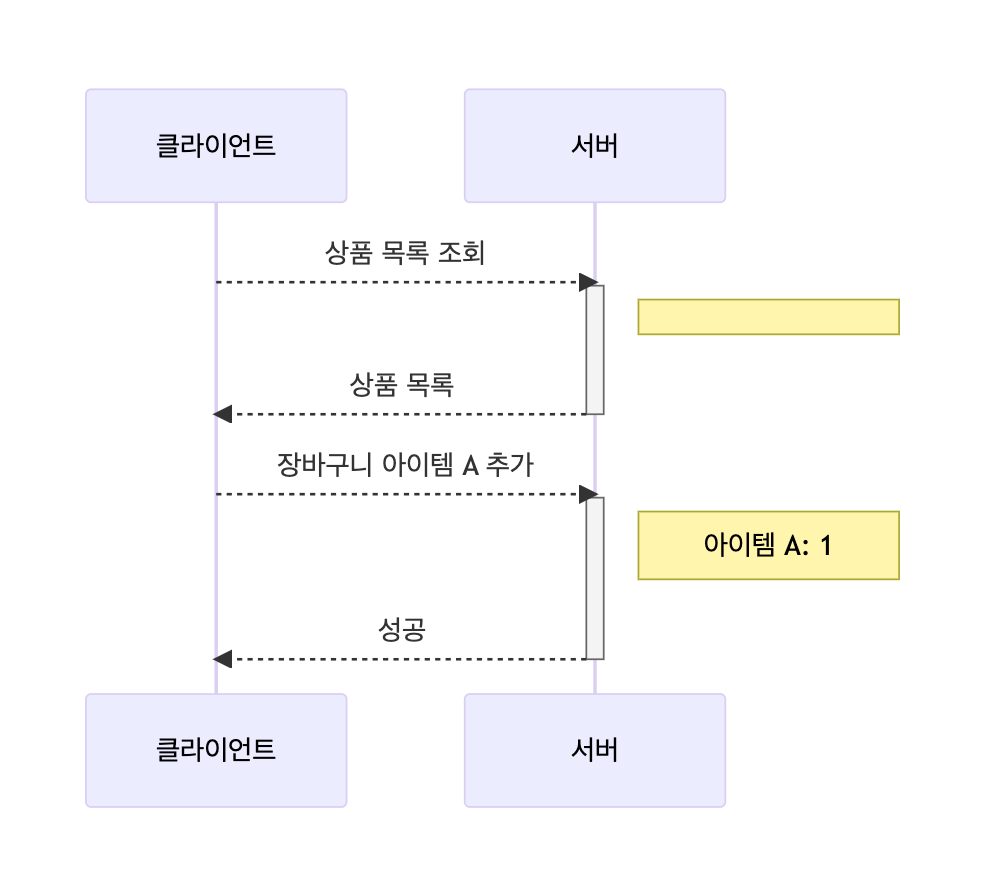
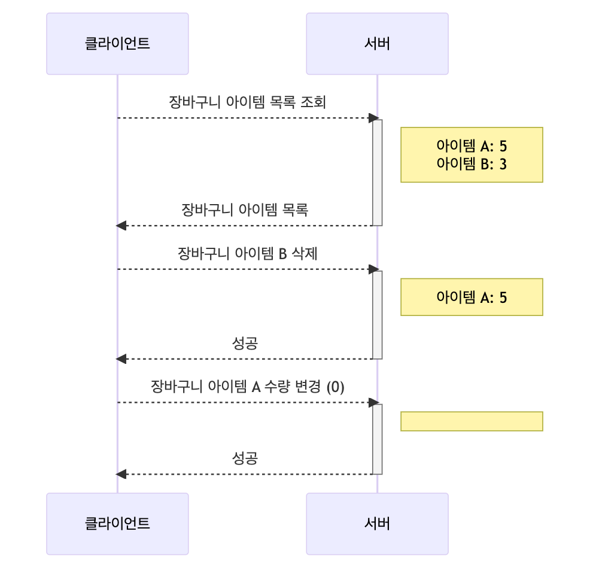
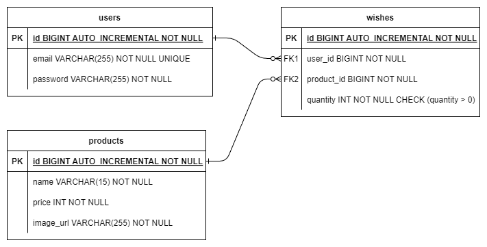
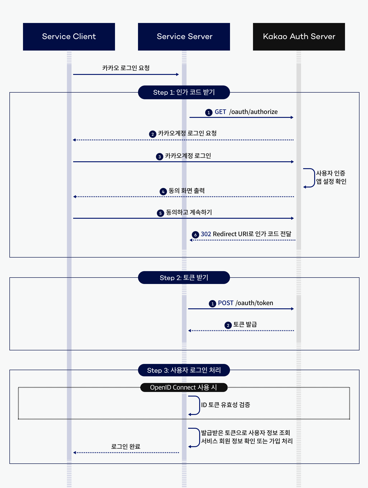
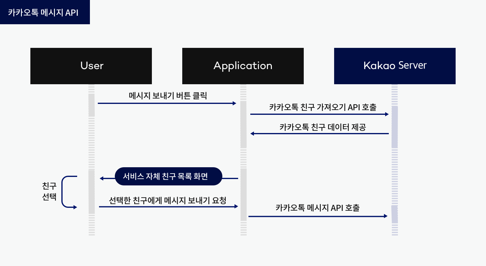

# spring-gift-point


## 목차

0. 이번 주차
   1. [1단계(API 명세)](#1단계API-명세-요구사항)
   1. [2단계(배포하기)](#2단계배포하기-요구사항)
   
1. [1주차 - product](#1주차-과제-요구사항spring-gift-product)
   1. [1단계(상품 API)](#1단계상품-api-요구사항)
   2. [2단계(관리자 화면)](#2단계관리자-화면-요구사항)
   3. [3단계(데이터베이스 적용)](#3단계데이터베이스-적용-요구사항)

2. [2주차 - wish](#2주차-과제-요구사항spring-gift-wish)
   1. [1단계(유효성 검사 및 예외 처리)](#1단계유효성-검사-및-예외-처리-요구사항)
   2. [2단계(회원 로그인)](#2단계회원-로그인-요구사항)
   3. [3단계(위시 리스트)](#3단계위시-리스트-요구사항)

3. [3주차 - jpa](#3주차-과제-요구사항spring-gift-jpa)
   1. [1단계(엔티티 매핑)](#1단계엔티티-매핑-요구사항)
   2. [2단계(연관 관계 매핑)](#2단계연관-관계-매핑-요구사항)
   3. [3단계(페이지네이션)](#3단계페이지네이션-요구사항)

4. [4주차 - enhancement](#4주차-과제-요구사항spring-gift-enhancement)
   1. [1단계(상품 카테고리)](#1단계상품-카테고리-요구사항)
   2. [2단계(상품 옵션)](#2단계상품-옵션-요구사항)
   3. [3단계(옵션 수량 차감)](#3단계옵션-수량-차감-요구사항)

5. [5주차 - order](#5주차-과제-요구사항spring-gift-order)
   1. [1단계(카카오 로그인)](#1단계카카오-로그인-요구사항)
   2. [2단계(주문하기)](#2단계주문하기-요구사항)
   3. [3단계(API 문서 만들기)](#3단계API-문서-만들기-요구사항)


---

## 1단계(API 명세) 요구사항

### 기능 요구사항

작성한 API 문서를 기반으로 팀 내에서 지금까지 만든 API를 검토하고 통일하여 변경 사항을 반영한다.

- 팀 내에서 일관된 기준을 정하여 API 명세를 결정한다.
- 때로는 클라이언트의 편의를 위해 API 명세를 결정하는 것이 좋다.

### API 문서

[notion](https://supreme-jewel-53e.notion.site/API-cc0ccfb63a2945d2835a4b330aaa304d?pvs=4)에서 작업했습니다.


## 2단계(배포하기) 요구사항

### 기능 요구 사항

지금까지 만든 선물하기 서비스를 배포하고 클라이언트와 연동할 수 있어야 한다.

- 지속적인 배포를 위한 배포 스크립트를 작성한다.
- 클라이언트와 API 연동 시 발생하는 보안 문제에 대응한다.
  - 서버와 클라이언트의 `Origin`이 달라 요청을 처리할 수 없는 경우를 해결한다.
- HTTPS는 필수는 아니지만 팀 내에서 논의하고 필요한 경우 적용한다.

### 힌트

#### 셸 스크립트

- 일련의 Linux 명령어로 구성된 텍스트 파일
- 생산성을 높여 주는 도구
  - 매번 같은 작업을 수행하기 위해 같은 명령을 반복해서 입력해야 할까?
  - 배포할 때마다 모든 명령을 외우고 실행해야 할까?
- [수업 개요 + 셸(SHELL)](https://missing-semester-kr.github.io/2020/course-shell)
- [셸 툴과 스크립팅](https://missing-semester-kr.github.io/2020/shell-tools)
- [The Shell Scripting Tutorial](https://www.shellscript.sh/first.html)

```sh
#!/bin/bash
BUILD_PATH=$(ls /home/ubuntu/build/*.jar)
JAR_NAME=$(basename $BUILD_PATH)

CURRENT_PID=$(pgrep -f $JAR_NAME)

if [ -z $CURRENT_PID ]
then
  sleep 1
else
  kill -15 $CURRENT_PID
  sleep 5
fi

DEPLOY_PATH=/home/ubuntu/
cp $BUILD_PATH $DEPLOY_PATH
cd $DEPLOY_PATH

DEPLOY_JAR=$DEPLOY_PATH$JAR_NAME
nohup java -jar $DEPLOY_JAR > /dev/null 2> /dev/null < /dev/null &
```

#### 네트워크

웹 애플리케이션은 네트워크를 통해 사용자에게 가치를 제공한다. 따라서 네트워크 문제로 인해 서비스에 심각한 문제가 발생할 수 있다. 안정적인 서비스 운영을 위해서는 네트워크에 대한 사전 학습이 필요하다.

<iframe src="https://www.youtube.com/embed/1pfTxp25MA8" class="width-100" frameborder="0" allowfullscreen="" style="box-sizing: content-box; background-repeat: no-repeat; padding: 0px; margin: 0px; border: 0px; width: 920px; top: 0px; left: 0px; height: 517.5px; line-height: 24px;"></iframe>

#### CORS

- [교차 출처 리소스 공유 (CORS)](https://developer.mozilla.org/ko/docs/Web/HTTP/CORS)
- [CORS는 왜 이렇게 우리를 힘들게 하는걸까?](https://evan-moon.github.io/2020/05/21/about-cors)

#### CorsConfiguration#applyPermitDefaultValues()

- Allow all origins.
- Allow "simple" methods `GET`, `HEAD` and `POST`.
- Allow all headers.
- Set max age to 1800 seconds (30 minutes).

#### 테스트

```java
@SpringBootTest
@AutoConfigureMockMvc
class AcceptanceTest {
    @Autowired
    private MockMvc mockMvc;

    @Test
    void cors() throws Exception {
        mockMvc.perform(
            options("/api/products")
                .header(HttpHeaders.ORIGIN, "http://localhost:8080")
                .header(HttpHeaders.ACCESS_CONTROL_REQUEST_METHOD, "GET")
        )
            .andExpect(status().isOk())
            .andExpect(header().string(HttpHeaders.ACCESS_CONTROL_ALLOW_ORIGIN, "*"))
            .andExpect(header().string(HttpHeaders.ACCESS_CONTROL_ALLOW_METHODS, ALLOWED_METHOD_NAMES))
            .andExpect(header().string(HttpHeaders.ACCESS_CONTROL_EXPOSE_HEADERS, HttpHeaders.LOCATION))
            .andDo(print())
        ;
    }
}
```

### 기능 목록

- [x] CORS 문제 해결
- [ ] 배포 스크립트 작성


---

# 1주차 과제 요구사항(spring-gift-product)

## 1단계(상품 API) 요구사항

### 과제 진행 요구 사항

* 미션은 선물하기 상품 관리 저장소를 포크하고 클론하는 것으로 시작한다.
* 온라인 코드 리뷰 요청 1단계 문서를 참고하여 실습 환경을 구축한다.
  1. 미션 시작 버튼을 클릭하여 미션을 시작한다.
  2. 저장소에 GitHub 사용자 이름으로 브랜치가 생성되었는지 확인한다.
  3. 저장소를 내 계정으로 포크한다.
* 기능을 구현하기 전 README.md에 구현할 기능 목록을 정리해 추가한다.
* Git의 커밋 단위는 앞 단계에서 README.md에 정리한 기능 목록 단위로 추가한다.
  * AngularJS Git Commit Message Conventions을 참고해 커밋 메시지를 작성한다.


### 기능 요구 사항

상품을 조회, 추가, 수정, 삭제할 수 있는 간단한 HTTP API를 구현한다.

* HTTP 요청과 응답은 JSON 형식으로 주고받는다.
* 현재는 별도의 데이터베이스가 없으므로 적절한 자바 컬렉션 프레임워크를 사용하여 메모리에 저장한다.

#### 예시

**Request**

```http
GET /api/products HTTP/1.1
```

**Response**

```http
HTTP/1.1 200 
Content-Type: application/json

[
  {
    "id": 8146027,
    "name": "아이스 카페 아메리카노 T",
    "price": 4500,
    "imageUrl": "https://st.kakaocdn.net/product/gift/product/20231010111814_9a667f9eccc943648797925498bdd8a3.jpg"
  }
]
```


### 1단계 기능 목록

> 패키지 분리 없이 단일 패키지로 진행. 단계를 진행하며 패키지 분리 리팩토링할 지 고려

**Product 클래스**

상품의 정보를 저장하는 객체

* 필드: `Long id`, `String name`, `int price`, `String imageUrl`
* 메서드
  * `public Product(Long id, String name, int price, String imageUrl)`


**ProductController 클래스 @RestController**

상품 조회, 추가, 수정, 삭제를 처리하는 엔드포인트 정의

* 엔드포인트
  * `GET /api/products`: 모든 상품 조회
  * `GET /api/products/{id}`: id를 통해 상품 조회
  * `POST /api/products`: JSON을 통해 새로운 상품 추가
  * `PUT /api/products/{id}`: 특정 id의 상품 수정
  * `DELETE /api/products/{id}`: 특정 id의 상품 삭제


**ProductService 클래스**

상품 조회, 추가, 수정, 삭제 기능을 실질적으로 처리하는 클래스

* 필드: `private final Map<Long, Product> products`: 상품 정보를 저장하는 저장소. <id, 상품>의 HashSet

* 메서드
  * `public List<Product> getAllProducts()`: 모든 상품 조회
  * `public Product getProductById(Long id)`: `id`를 통해 상품 조회
  * `public addProduct(Product product)`: 새로운 상품 추가
    * JSON 형식이 이상할 경우 에러 발생
  * `public Product updateProduct(Long id, Product product)`: id를 통해 상품을 검색한 후 상품 수정
    * 존재하지 않는 상품인 경우 예외 발생
  * `public void deleteProduct(Long id)`: 특정 id의 상품 삭제
    * 존재하지 않는 상품인 경우 예외 발생


## 2단계(관리자 화면) 요구사항

### 기능 요구 사항

상품을 조회, 추가, 수정, 삭제할 수 있는 관리자 화면을 구현한다.

- [Thymeleaf](https://www.thymeleaf.org/)를 사용하여 [서버 사이드 렌더링](https://joshua1988.github.io/vue-camp/nuxt/ssr.html)을 구현한다.
- 기본적으로는 HTML 폼 전송 등을 이용한 페이지 이동을 기반으로 하지만, 자바스크립트를 이용한 비동기 작업에 관심이 있다면 이미 만든 상품 API를 이용하여 [AJAX](https://developer.mozilla.org/ko/docs/Glossary/AJAX) 등의 방식을 적용할 수 있다.
- 상품 이미지의 경우, 파일을 업로드하지 않고 URL을 직접 입력한다.

 ### 2단계 기능 목록

> 각 페이지는 /src/resources/templates 경로에 저장

**product_list.html**

* 모든 상품을 리스트로 조회하는 메인 페이지
* 각 상품마다 update, delete 버튼 존재
  * update 버튼은 `product_add_form.html` 페이지로 이동
  * delete 버튼은 추가적인 조작없이 delete method 전송을 통해 삭제 후 메인 페이지 새로 고침
* 새 상품을 추가하는 버튼 존재
  * 버튼을 누르면 `product_edit_form.html` 페이지로 이동


**product_add_form.html**

* 새 상품을 추가하는 페이지
* 각 정보를 html 폼으로 입력받아 `POST /api/products`로 요청하여 저장


**product_edit_form.html**

* 상품을 수정하는 페이지
* 각 정보를 html 폼으로 입력받아 `PUT /api/products/{id}`로 요청하여 수정


## 3단계(데이터베이스 적용) 요구사항

### 3단계 기능 목록

#### 데이터베이스 구축

- [x] 기존 메모리 저장 로직 삭제
- [x] H2 데이터베이스 연결
- [x] `ProductService`의 기존 메서드들 DB 로직으로 대체
  - [x] `getAllProducts`
  - [x] `getProductById`
  - [x] `addProduct`
  - [x] `updateProduct`
  - [x] `deleteProduct`


### 기능 요구 사항

자바 컬렉션 프레임워크를 사용하여 메모리에 저장하던 상품 정보를 데이터베이스에 저장한다.

### 프로그래밍 요구 사항

- 메모리에 저장하고 있던 모든 코드를 제거하고 H2 데이터베이스를 사용하도록 변경한다.
- 사용하는 테이블은 애플리케이션이 실행될 때 구축되어야 한다.


---


# 2주차 과제 요구사항(spring-gift-wish)

## 1단계(유효성 검사 및 예외 처리) 요구사항

### 기능 요구사항

상품을 추가하거나 수정하는 경우, 클라이언트로부터 잘못된 값이 전달될 수 있다. 잘못된 값이 전달되면 클라이언트가 어떤 부분이 왜 잘못되었는지 인지할 수 있도록 응답을 제공한다.

- 상품 이름은 공백을 포함하여 최대 15자까지 입력할 수 있다.
- 특수 문자
  - 가능: ( ), [ ], +, -, &, /, _
  - 그 외 특수 문자 사용 불가
- "카카오"가 포함된 문구는 담당 MD와 협의한 경우에만 사용할 수 있다.


### 1단계 기능 목록

* 상품 추가 및 수정 기능에서의 유효성 검증
  * [x] 상품 이름은 공백을 포함하여 최대 15자까지 입력 가능
  * [x] 유효한 특수 문자만 입력 가능 - 정규식 사용(`^[a-zA-Z가-힣0-9 ()\[\]\+\-\&/\_]*$`)
  * [x] "카카오"가 포함된 문구가 입력된다면 예외 처리 후 클라이언트에게 안내
* Exception 및 ExceptionHandler 정의
  * [x] `InvalidProductNameException` 정의
  * [x] `RestrictedKeywordException` 정의
  * [x] ExceptionHandler 정의
    * [x] 상품 이름 길이에 관한 예외(`InvalidProductNameException`)
    * [x] 상품 이름 특수문자에 관한 예외(`InvalidProductNameException`)
    * [x] 특정 문구에 관한 예외(`RestrictedKeywordException`)


## 2단계(회원 로그인) 요구사항

### 기능 요구 사항

사용자가 회원 가입, 로그인, 추후 회원별 기능을 이용할 수 있도록 구현한다.

* 회원은 이메일과 비밀번호를 입력하여 가입한다.
* 토큰을 받으려면 이메일과 비밀번호를 보내야 하며, 가입한 이메일과 비밀번호가 일치하면 토큰이 발급된다.
* 토큰을 생성하는 방법에는 여러 가지가 있다. 방법 중 하나를 선택한다.
* (선택) 회원을 조회, 추가, 수정, 삭제할 수 있는 관리자 화면을 구현한다.

아래 예시와 같이 HTTP 메시지를 주고받도록 구현한다.

사용자가 회원 가입, 로그인, 추후 회원별 기능을 이용할 수 있도록 구현한다.

- 회원은 이메일과 비밀번호를 입력하여 가입한다.
- 토큰을 받으려면 이메일과 비밀번호를 보내야 하며, 가입한 이메일과 비밀번호가 일치하면 토큰이 발급된다.
- 토큰을 생성하는 방법에는 여러 가지가 있다. 방법 중 하나를 선택한다.
- (선택) 회원을 조회, 추가, 수정, 삭제할 수 있는 관리자 화면을 구현한다.

아래 예시와 같이 HTTP 메시지를 주고받도록 구현한다.

#### 회원 가입

##### Request

```http
POST /members/register HTTP/1.1
content-type: application/json
host: localhost:8080

{
    "email": "admin@email.com",
    "password": "password"
}
```

##### Response

```http
HTTP/1.1 200
Content-Type: application/json

{
    "token": ""
}
```

#### 로그인

```http
POST /members/login HTTP/1.1
content-type: application/json
host: localhost:8080

{
    "email": "admin@email.com",
    "password": "password"
}
```

##### Response

```http
HTTP/1.1 200
Content-Type: application/json

{
    "token": ""
}
```

### 힌트

#### Basic 인증

Base64로 인코딩된 사용자 ID, 비밀번호 쌍을 인증 정보(credentials) 값으로 사용한다.

```html
Authorization: Basic base64({EMAIL}:{PASSWORD})
```

#### JSON Web Token

[JJWT](https://github.com/jwtk/jjwt) 라이브러리를 사용하여 JWT을 쉽게 만들 수 있다.

```java
dependencies {
    compileOnly 'io.jsonwebtoken:jjwt-api:0.12.6'
    runtimeOnly 'io.jsonwebtoken:jjwt-impl:0.12.6'
    runtimeOnly 'io.jsonwebtoken:jjwt-jackson:0.12.6'
}
String secretKey = "Yn2kjibddFAWtnPJ2AFlL8WXmohJMCvigQggaEypa5E=";
String accessToken = Jwts.builder()
    .setSubject(member.getId().toString())
    .claim("name", member.getName())
    .claim("role", member.getRole())
    .signWith(Keys.hmacShaKeyFor(secretKey.getBytes()))
    .compact();
```

#### 응답 코드

- Authorization 헤더가 유효하지 않거나 토큰이 유효하지 않은 경우 [`401 Unauthorized`](https://developer.mozilla.org/ko/docs/Web/HTTP/Status/401)를 반환한다.

> `401 Unauthorized` 클라이언트 오류 상태 응답 코드는 해당 리소스에 유효한 인증 자격 증명이 없기 때문에 요청이 적용되지 않았음을 나타냅니다. 이 상태는 WWW-Authenticate (en-US) 헤더와 함께 전송되며, 이 헤더는 올바르게 인증하는 방법에 대한 정보를 포함하고 있습니다. 이 상태는 `403`과 비슷하지만, `401 Unauthorized`의 경우에는 인증이 가능합니다.

- 잘못된 로그인, 비밀번호 찾기, 비밀번호 변경 요청은 [`403 Forbidden`](https://developer.mozilla.org/ko/docs/Web/HTTP/Status/403)을 반환한다.

> HTTP `403 Forbidden` 클라이언트 오류 상태 응답 코드는 서버에 요청이 전달되었지만, 권한 때문에 거절되었다는 것을 의미합니다. 이 상태는 `401`과 비슷하지만, 로그인 로직(틀린 비밀번호로 로그인 행위)처럼 반응하여 재인증(re-authenticating)을 하더라도 지속적으로 접속을 거절합니다.


### 2단계 기능 목록

- 회원 DTO 클래스 (User)
- 회원 관련 Controller
  - [x] `POST /api/members/register`: 회원가입
  - [x] `POST /api/members/login`: 로그인
- 회원 관련 Service
  - [x] 회원가입
  - [x] 로그인


## 3단계(위시 리스트) 요구사항

### 기능 요구 사항

이전 단계에서 로그인 후 받은 토큰을 사용하여 사용자별 위시 리스트 기능을 구현한다.

- 위시 리스트에 등록된 상품 목록을 조회할 수 있다.
- 위시 리스트에 상품을 추가할 수 있다.
- 위시 리스트에 담긴 상품을 삭제할 수 있다.

### 실행 결과

사용자 정보는 요청 헤더의 `Authorization` 필드를 사용한다.

- `Authorization: <유형> <자격증명>`

```http
Authorization: Bearer token
```

### 힌트

#### 사용자 시나리오

##### 위시 리스트 상품 추가



##### 위시 리스트 상품 삭제



#### HandlerMethodArgumentResolver

컨트롤러 메서드에 진입하기 전에 전처리를 통해 객체를 주입할 수 있다.

```java
public class LoginMemberArgumentResolver implements HandlerMethodArgumentResolver {

    private final MemberService memberService;

    public LoginMemberArgumentResolver(MemberService memberService) {
        this.memberService = memberService;
    }

    @Override
    public boolean supportsParameter(MethodParameter parameter) {
        return parameter.getParameterAnnotation(LoginMember.class);
    }

    @Override
    public Object resolveArgument(MethodParameter parameter, ModelAndViewContainer mavContainer,
        NativeWebRequest webRequest, WebDataBinderFactory binderFactory) throws Exception {
        // ...
        return new LoginMember(member.getId(), member.getName(), member.getEmail(),
            member.getRole());
    }
}
```

```java
@PostMapping("/wishes")
public void create(
    @RequestBody WishRequest request,
    @LoginMember Member member
) {
}
```


### 3단계 기능 목록

- [x] WishController

  * 각 요청은 user의 토큰을 headers에 포함

  - [x] `GET /api/wishes`: 유저의 위시리스트 조회

  - [x] `POST /api/wishes`: 유저의 위시리스트 추가

    * `productId`를 통해 `products`테이블에서 상품 정보 가져옴

  - [x] `PATCH /api/wishes`: 위시리스트의 특정 상품의 개수 수정

    - Request

      ```http
      PATCH /api/wishes HTTP/1.1
      content-type: application/json
      Authorization: Basic {token}
      {
          "product_id": LONG,
          "product_count": INT
      }
      ```

    * Response

     ```http
    HTTP/1.1 200
    content-type: application/json
    [
    	{
    		"product": Product
    		"counts": product_count
    	},
    	...
    ]
     ```

  - [x] `DELETE /api/wishes/{productId}`: 위시리스트에서 특정 상품 삭제

- [x] WishService

  - [x] 조회
  - [x] 추가
  - [x] 수정
  - [x] 삭제

- [x] 위시리스트 접근 인가/인증

- [x] 각 기능 예외처리

  - [x] 조회
    * wishes 테이블에 해당하는 user_id 레코드가 존재하지 않으면 `WishNotFoundException`발생
    * user_id가 users 테이블에 존재하지 않는 경우 -> `LoginUserArgumentResolver`에 의해 토큰이 존재하지 않아 reject됨

  - [x] 추가
    * `quantity`가 0이하인 경우`@Positive`으로 인해 자동으로 `400 Bad Request` 반환
    * 잘못된 product_id로 request한 경우 `ProductNotFoundException`발생

  - [x] 수정
    * 현재 존재하지 않는 wish에 대한 삭제를 요청할 시 `WishNotFoundException` 발생

  - [x] 삭제
    * 존재하지 않는 wish에 대한 삭제를 요청할 시 `WishNotFoundException` 발생

- 위시리스트 테이블 스키마

  ```sql
  CREATE TABLE wishes (
      id LONG AUTO_INCREMENT PRIMARY KEY,
      user_id LONG,
      product_id LONG,
      product_count INT,
      FOREIGN KEY (user_id) REFERENCES users(id),
      FOREIGN KEY (product_id) REFERENCES products(id)
  )
  ```


---

# 3주차 과제 요구사항(spring-gift-jpa)

## 1단계(엔티티 매핑) 요구사항

### 기능 요구 사항

지금까지 작성한 JdbcTemplate 기반 코드를 JPA로 리팩터링하고 실제 도메인 모델을 어떻게 구성하고 객체와 테이블을 어떻게 매핑해야 하는지 알아본다.

- 아래의 DDL(Data Definition Language)을 보고 유추하여 엔티티 클래스와 리포지토리 클래스를 작성해 본다.
- `@DataJpaTest`를 사용하여 학습 테스트를 해 본다.

```sql
create table member
(
    id       bigint generated by default as identity,
    email    varchar(255) not null unique,
    password varchar(255) not null,
    primary key (id)
)
create table product
(
    price     integer      not null,
    id        bigint generated by default as identity,
    name      varchar(15)  not null,
    image_url varchar(255) not null,
    primary key (id)
)
create table wish
(
    id         bigint generated by default as identity,
    member_id  bigint not null,
    product_id bigint not null,
    primary key (id)
)
```

### 힌트

Spring Data JPA 사용 시 아래 옵션은 동작 쿼리를 로그로 확인할 수 있게 해준다.

```plaintext
spring.jpa.properties.hibernate.format_sql=true
spring.jpa.show-sql=true
```

[Auto-configured Data JPA Tests](https://docs.spring.io/spring-boot/docs/current/reference/htmlsingle/#features.testing.spring-boot-applications.autoconfigured-spring-data-jpa)

```java
@DataJpaTest
class StationRepositoryTest {
    @Autowired
    private StationRepository stations;
    
    @Test
    void save() {
        Station expected = new Station("잠실역");
        Station actual = stations.save(expected);
        assertAll(
                () -> assertThat(actual.getId()).isNotNull(),
                () -> assertThat(actual.getName()).isEqualTo(expected.getName())
        );
    }

    @Test
    void findByName() {
        String expected = "잠실역";
        stations.save(new Station(expected));
        String actual = stations.findByName(expected).getName();
        assertThat(actual).isEqualTo(expected);
    }
}
```

H2 데이터베이스를 사용한다면 아래의 프로퍼티를 추가하면 MySQL Dialect을 사용할 수 있다.

```plaintext
spring.datasource.url=jdbc:h2:mem:test;MODE=MYSQL;DB_CLOSE_DELAY=-1
spring.jpa.properties.hibernate.dialect=org.hibernate.dialect.MySQLDialect
create table member
(
    id       bigint       not null auto_increment,
    email    varchar(255) not null,
    password varchar(255) not null,
    primary key (id)
) engine=InnoDB

create table product
(
    price     integer      not null,
    id        bigint       not null auto_increment,
    name      varchar(15)  not null,
    image_url varchar(255) not null,
    primary key (id)
) engine=InnoDB

create table wish
(
    id         bigint not null auto_increment,
    member_id  bigint not null,
    product_id bigint not null,
    primary key (id)
) engine=InnoDB

alter table member
    add constraint uk_member unique (email)
```


### 1단계 기능 목록

- [x] 엔티티 매핑
  - [x] product
  - [x] member(이름 User 사용)
  - [x] wish
- [x] Repository 인터페이스
  - [x] product
  - [x] member(user)
  - [x] wish
- [x] 학습 테스트 작성
  - [x] ProductRepository
  - [x] UserRepository
  - [x] WishRepository


## 2단계(연관 관계 매핑) 요구사항

### 기능 요구 사항

지금까지 작성한 JdbcTemplate 기반 코드를 JPA로 리팩터링하고 실제 도메인 모델을 어떻게 구성하고 객체와 테이블을 어떻게 매핑해야 하는지 알아본다.

- 객체의 참조와 테이블의 외래 키를 매핑해서 객체에서는 참조를 사용하고 테이블에서는 외래 키를 사용할 수 있도록 한다.


### 2단계 기능 목록



- [x] users - wishes 간 관계 연결
  * wishes 기준 ManyToOne
- [x] products - wishes 간 관계 연결
  * wishes 기준 ManyToOne

#### 결과

```sql
Hibernate: 
    create table products (
        price integer not null,
        id bigint generated by default as identity,
        name varchar(15) not null,
        image_url varchar(255) not null,
        primary key (id)
    )
Hibernate: 
    create table users (
        id bigint generated by default as identity,
        email varchar(255) not null unique,
        password varchar(255) not null,
        primary key (id)
    )
Hibernate: 
    create table wishes (
        quantity integer not null,
        id bigint generated by default as identity,
        product_id bigint not null,
        user_id bigint not null,
        primary key (id)
    )
Hibernate: 
    alter table if exists wishes 
       add constraint fk_wishes_product_id_ref_products_id 
       foreign key (product_id) 
       references products
Hibernate: 
    alter table if exists wishes 
       add constraint fk_wishes_user_id_ref_users_id 
       foreign key (user_id) 
       references users
```


## 3단계(페이지네이션) 요구사항

### 과제 진행 요구 사항

상품과 위시 리스트 보기에 페이지네이션을 구현한다.

- 대부분의 게시판은 모든 게시글을 한 번에 표시하지 않고 여러 페이지로 나누어 표시한다. 정렬 방법을 설정하여 보고 싶은 정보의 우선 순위를 정할 수도 있다.
- 페이지네이션은 원하는 정렬 방법, 페이지 크기 및 페이지에 따라 정보를 전달하는 방법이다.


### 힌트

이를 직접 구현할 수도 있지만, 스프링 데이터는 `Pageable`이라는 객체를 제공하여 쉽게 구현할 수 있다. 또한 `List`, `Slice`, `Page` 등 다양한 반환 타입을 제공한다.


#### 참고자료

- [Paging, Iterating Large Results, Sorting & Limiting](https://docs.spring.io/spring-data/jpa/reference/repositories/query-methods-details.html#repositories.special-parameters)
- [Pagination and Sorting using Spring Data JPA](https://www.baeldung.com/spring-data-jpa-pagination-sorting)
- [Converting List to Page Using Spring Data JPA](https://www.baeldung.com/spring-data-jpa-convert-list-page)


### 3단계 To-do

- [x] Product Pagination
- [ ] ~~User Pagination~~
  * user 전체에 대한 get 요청이 없으므로 해당 없음
  * 추후 회원 관리 등의 기능이 필요할 시 개발 예정
- [x] Wish Pagination


---

# 4주차 과제 요구사항(spring-gift-enhancement)

## 1단계(상품 카테고리) 요구사항

### 기능 요구 사항

상품 정보에 카테고리를 추가한다. 상품과 카테고리 모델 간의 관계를 고려하여 설계하고 구현한다.

- 카테고리는 1차 카테고리만 있으며 2차 카테고리는 고려하지 않는다.
- 카테고리는 수정할 수 있다.
- 관리자 화면에서 상품을 추가할 때 카테고리를 지정할 수 있다.
- 카테고리의 예시는 아래와 같다.
  - 교환권, 상품권, 뷰티, 패션, 식품, 리빙/도서, 레저/스포츠, 아티스트/캐릭터, 유아동/반려, 디지털/가전, 카카오프렌즈, 트렌드 선물, 백화점

아래 예시와 같이 HTTP 메시지를 주고받도록 구현한다.

#### Request

```http
GET /api/categories HTTP/1.1
```

#### Response

```http
HTTP/1.1 200 
Content-Type: application/json

[
  {
    "id": 91,
    "name": "교환권",
    "color": "#6c95d1",
    "imageUrl": "https://gift-s.kakaocdn.net/dn/gift/images/m640/dimm_theme.png",
    "description": ""
  }
]
```

### 프로그래밍 요구 사항

- 구현한 기능에 대해 적절한 테스트 전략을 생각하고 작성한다.


### 1단계 기능 목록

- [x] 카테고리 엔티티 추가
- [x] 상품과 카테고리 간 관계 생성
- [x] 카테고리 CRUD 추가
  - [x] `GET /api/categories`: 모든 카테고리 조회
  - [x] `GET /api/categories/{id}` 특정 id 카테고리 조회
  - [x] `POST /api/categories`: 추가
  - [x] `PATCH /api/categories/{id}`:수정 - id를 고정으로 name만 수정하므로 PATCH 사용
  - [x] `DELETE /api/categories/{id}`: 삭제
- [x] 상품 생성/수정할 때 카테고리 선택 가능
  - [x] 어드민 페이지에서 가능하도록 수정


## 2단계(상품 옵션) 요구사항

### 기능 요구 사항

상품 정보에 옵션을 추가한다. 상품과 옵션 모델 간의 관계를 고려하여 설계하고 구현한다.

- 상품에는 항상 하나 이상의 옵션이 있어야 한다.
  - 옵션 이름은 공백을 포함하여 최대 50자까지 입력할 수 있다.
  - 특수 문자
    - 가능: ( ), [ ], +, -, &, /, _
    - 그 외 특수 문자 사용 불가
  - 옵션 수량은 최소 1개 이상 1억 개 미만이다.
- 중복된 옵션은 구매 시 고객에게 불편을 줄 수 있다. 동일한 상품 내의 옵션 이름은 중복될 수 없다.
- (선택) 관리자 화면에서 옵션을 추가할 수 있다.

아래 예시와 같이 HTTP 메시지를 주고받도록 구현한다.

#### Request

```http
GET /api/products/1/options HTTP/1.1
```

#### Response

```http
HTTP/1.1 200 
Content-Type: application/json

[
  {
    "id": 464946561,
    "name": "01. [Best] 시어버터 핸드 & 시어 스틱 립 밤",
    "quantity": 969
  }
]
```


### 2단계 기능 목록

- [x] Option entity
  - [x] 옵션 이름은 공백을 포함하여 최대 50자
  - [x] 특수 문자 `( ), [ ], +, -, &, /, _`외에 사용 불가
  - [x] 옵션 수량(quantity)는 1개 이상 1억 개 미만
  - [x] 동일한 상품 내 옵션 이름 중복 허용 X
  - [x] 상품에는 하나 이상의 옵션이 존재할 필요가 있음
    - [x] 상품을 최초 생성할 때, 옵션도 함께 생성
      * 최소 생성 이외에는 Option CRUD로 처리 가능
    - [x] 옵션 삭제 시, 해당 옵션이 상품의 유일한 옵션이라면 삭제 불가
- [x] Option CRUD
  - [x] Create
  - [x] Read
  - [x] Update
  - [x] Delete
- [ ] (선택) 관리자 화면에서 옵션 추가


## 3단계(옵션 수량 차감) 요구사항

### 기능 요구 사항

상품 옵션의 수량을 지정된 숫자만큼 빼는 기능을 구현한다.

- 별도의 HTTP API를 만들 필요는 없다.
- 서비스 클래스 또는 엔티티 클래스에서 기능을 구현하고 나중에 사용할 수 있도록 한다.

### 프로그래밍 요구 사항

- 구현한 기능에 대해 적절한 테스트 전략을 생각하고 작성한다.
- 단위 테스트하기 어려운 코드와 단위 테스트 가능한 코드를 분리해 단위 테스트 가능한 코드에 대해 단위 테스트를 구현한다.

### 힌트

```java
var option = optionRepository.findByProductId(productId).orElseThrow();
option.subtract(quantity);
```


### 3단계 기능 목록

* 테스트 코드 작성
* [x] 옵션 수량 차감 기능 구현
  * [x] 차감을 원하는 양이 현재 quantity보다 크지 않아야 함

---

# 5주차 과제 요구사항(spring-gift-order)

## 1단계(카카오 로그인) 요구사항

### 과제 진행 요구 사항

- 카카오 API를 사용하기 위한 [애플리케이션을 등록](https://developers.kakao.com/docs/latest/ko/getting-started/quick-start#create)한다.
- 등록한 후 아래 안내에 따라 설정한다.
  - 내 애플리케이션 > 제품 설정 > 카카오 로그인 > **활성화 설정 ON** ([카카오 로그인 활성화 설정](https://developers.kakao.com/docs/latest/ko/kakaologin/prerequisite#kakao-login-activate))
  - 내 애플리케이션 > 제품 설정 > 카카오 로그인 > **Redirect URI 등록 > `http://localhost:8080` 저장** ([Redirect URI 등록](https://developers.kakao.com/docs/latest/ko/kakaologin/prerequisite#kakao-login-redirect-uri))
  - 내 애플리케이션 > 제품 설정 > 카카오 로그인 > 동의항목 > 접근권한 > **카카오톡 메시지 전송 > 선택 동의** ([접근권한 동의항목](https://developers.kakao.com/docs/latest/ko/kakaologin/prerequisite#permission))

### 기능 요구 사항

카카오 로그인을 통해 인가 코드를 받고, 인가 코드를 사용해 토큰을 받은 후 향후 카카오 API 사용을 준비한다.

- 카카오계정 로그인을 통해 인증 코드를 받는다.
- [토큰 받기](https://developers.kakao.com/docs/latest/ko/kakaologin/rest-api#request-token)를 읽고 액세스 토큰을 추출한다.
- 앱 키, 인가 코드가 절대 유출되지 않도록 한다.
  - 특히 시크릿 키는 GitHub나 클라이언트 코드 등 외부에서 볼 수 있는 곳에 추가하지 않는다.
- (선택) 인가 코드를 받는 방법이 불편한 경우 카카오 로그인 화면을 구현한다.

실제 카카오 로그인은 아래 그림과 같이 진행된다.



하지만 지금과 같이 클라이언트가 없는 상황에서는 아래와 같은 방법으로 인가 코드를 획득한다.

1. 내 애플리케이션 > 앱 설정 > 앱 키로 이동하여 REST API 키를 복사한다.
2. https://kauth.kakao.com/oauth/authorize?scope=talk_message&response_type=code&redirect_uri=http://localhost:8080&client_id=`{REST_API_KEY}`에 접속하여 **카카오톡 메시지 전송**에 동의한다.
3. http://localhost:8080/?code=`{AUTHORIZATION_CODE}`에서 인가 코드를 추출한다.


### 힌트

#### 애플리케이션 등록

카카오 플랫폼 서비스를 이용하여 개발한 애플리케이션은 이름, 아이콘, 상품명, 서비스명, 회사명, 로고, 심벌 등에 카카오의 상표를 사용할 수 없으므로([제17조(상표 사용 시 의무 사항)](https://developers.kakao.com/terms/latest/ko/site-policies#trademark-requirement)), 아래와 같이 간단하게 작성해도 된다.

- 앱 이름: `spring-gift`
- 회사명: 본인의 이름
- 카테고리: `교육`

#### 토큰 요청

[토큰 받기](https://developers.kakao.com/docs/latest/ko/kakaologin/rest-api#request-token)에 따르면 아래와 같이 `RequestEntity`를 만들 수 있다.

```java
var url = "https://kauth.kakao.com/oauth/token";
var headers = new HttpHeaders();
headers.add(HttpHeaders.CONTENT_TYPE, MediaType.APPLICATION_FORM_URLENCODED_VALUE);
var body = new LinkedMultiValueMap<String, String>();
body.add("grant_type", "authorization_code");
body.add("client_id", properties.clientId());
body.add("redirect_uri", properties.redirectUri());
body.add("code", authorizationCode);
var request = new RequestEntity<>(body, headers, HttpMethod.POST, URI.create(url));
```

#### 오류 처리

- [레퍼런스](https://developers.kakao.com/docs/latest/ko/rest-api/reference)와 [문제 해결](https://developers.kakao.com/docs/latest/ko/kakaologin/trouble-shooting)을 참고하여 발생할 수 있는 다양한 오류를 처리한다.
- 예를 들어, 아래의 경우 카카오톡 메시지 전송에 동의하지 않았으므로 과제 진행 요구 사항의 안내에 따라 설정한다.

```plaintext
403 Forbidden: "{"msg":"[spring-gift] App disabled [talk_message] scopes for [TALK_MEMO_DEFAULT_SEND] API on developers.kakao.com. Enable it first.","code":-3}"
```

- `RestTemplate`을 사용하는 경우 [Spring RestTemplate Error Handling](https://www.baeldung.com/spring-rest-template-error-handling)를 참고한다.

#### HTTP Client

- [REST Clients](https://docs.spring.io/spring-framework/reference/integration/rest-clients.html)
- 사용할 클라이언트를 선택할 때 어떤 기준을 사용해야 할까?
- 클라이언트 인스턴스를 효과적으로 생성/관리하는 방법은 무엇인가?

#### 더 적절한 테스트 방법이 있을까?

- 요청을 보내고 응답을 파싱하는 부분만 테스트하려면 어떻게 해야 할까?
- 비즈니스 로직에 연결할 때 단위/통합 테스트는 어떻게 할까?

#### API 호출에 문제가 발생하면 어떻게 할까?

- 응답 시간이 길면 어떻게 할까? 몇 초가 적당할까?
- 오류 코드는 어떻게 처리해야 할까?
- 응답 값을 파싱할 때 문제가 발생하면 어떻게 할까?


### 1단계 기능 목록

#### [기능 구현]

- [x] 클라이언트의 카카오 로그인 요청 처리

- [x] 클라이언트의 요청을 `GET /oauth/authorize`로 redirect

  * 이후 동의 등 로그인 과정은 API에서 처리
  * 인가코드를 쿼리 파라미터로 포함한 리디렉션 url로 이동

- [x] 리디렉션 uri에서 code 추출

- [x] code를 포함한 request body를 만들어 token 발급 요청

  ```http
  POST https://kauth.kakao.com/oauth/token HTTP/1.1
  Content-Type: application/x-www-form-urlencoded;charset=utf-8
  
  {
    "grant_type": "authorization_code",
    "client_id": "${REST-API-KEY}",
    "redirect_uri": "${REDIRECT-URI}",
    "code": validation code from oauth request
  }
  ```

- [x] 발급된 토큰으로 사용자 정보 요청

  ```http
  GET https://kapi.kakao.com/v2/user/me?property_keys=[""] HTTP/1.1
  Authorization: Bearer ${ACCESS_TOKEN}
  ```

- [x] Response 데이터 처리

  - [x] 최초 1회 회원가입 - 카카오 user id를 이용해 email로 만들어 User 테이블에 저장
  - [x] 이후 로그인 - User 테이블에서 데이터 호출하여 대조

- [x] 유저 정보를 바탕으로 jwt token 발급하여 클라이언트에 반환


##### 리팩토링

현재 코드 구현이 Controller - Client 연결로 되어있음

- [x] Controller - Service - Client 구조로 리팩토링 필요


#### [테스트]

- [ ] 서비스 서버 기능 통합 테스트
  * Kakao API를 mock객체로 주입하여 기능 테스트
  * [ ] Kakao API에서 에러를 반환하는 경우
  * [ ] Happy Case


## 2단계(주문하기) 요구사항

### 과제 진행 요구 사항

- 카카오 API를 사용하기 위한 [애플리케이션을 등록](https://developers.kakao.com/docs/latest/ko/getting-started/quick-start#create)한다.
- 등록한 후 아래 안내에 따라 설정한다.
  - 내 애플리케이션 > 제품 설정 > 카카오 로그인 > **활성화 설정 ON** ([카카오 로그인 활성화 설정](https://developers.kakao.com/docs/latest/ko/kakaologin/prerequisite#kakao-login-activate))
  - 내 애플리케이션 > 제품 설정 > 카카오 로그인 > **Redirect URI 등록 > `http://localhost:8080` 저장** ([Redirect URI 등록](https://developers.kakao.com/docs/latest/ko/kakaologin/prerequisite#kakao-login-redirect-uri))
  - 내 애플리케이션 > 제품 설정 > 카카오 로그인 > 동의항목 > 접근권한 > **카카오톡 메시지 전송 > 선택 동의** ([접근권한 동의항목](https://developers.kakao.com/docs/latest/ko/kakaologin/prerequisite#permission))
  - 내 애플리케이션 > 앱 설정 > **Web 플랫폼 등록 > `http://localhost:8080` 저장** ([Web](https://developers.kakao.com/docs/latest/ko/getting-started/app#platform-web))

### 기능 요구 사항

카카오톡 메시지 API를 사용하여 주문하기 기능을 구현한다.

- 주문할 때 수령인에게 보낼 메시지를 작성할 수 있다.

- 상품 옵션과 해당 수량을 선택하여 주문하면 해당 상품 옵션의 수량이 차감된다.

- 해당 상품이 위시 리스트에 있는 경우 위시 리스트에서 삭제한다.

- 나에게 보내기

  를 읽고 주문 내역을 카카오톡 메시지로 전송한다.

  - 메시지는 [메시지 템플릿](https://developers.kakao.com/docs/latest/ko/message/message-template)의 기본 템플릿이나 사용자 정의 템플릿을 사용하여 자유롭게 작성한다.

아래 예시와 같이 HTTP 메시지를 주고받도록 구현한다.

#### Request

```http
POST /api/orders HTTP/1.1
Authorization: Bearer {token}
Content-Type: application/json

{
    "option_id": 1,
    "quantity": 2,
    "message": "Please handle this order with care."
}
```

#### Response

```http
HTTP/1.1 201 Created
Content-Type: application/json

{
    "id": 1,
    "option_id": 1,
    "quantity": 2,
    "order_date_time": "2024-07-21T10:00:00",
    "message": "Please handle this order with care."
}
```

실제 카카오톡 메시지는 아래와 같이 전송된다. 하지만 이번 미션에서는 수신자가 나이기 때문에 카카오톡 친구 목록 가져오기는 생략한다.



### 시나리오

1. order 요청 (상품 옵션과 개수 선택)
2. order에서 요청된 만큼 옵션에서 개수 차감
   * 남은 재고가 요청 개수보다 작다면 reject
3. 해당 상품이 위시리스트에 있는 경우 위시리스트에서 삭제
4. 카카오 메시지 api로 메시지 보내기


### 기능 목록

- 아래 과정은 하나의 Transaction
- [x] 옵션 수량 차감 (`OptionService.subtractOptionQuantity()` 호출)
- [x] 옵션 상품 불러오기 - Option을 불러와 productId 사용
- [x] 옵션 상품 id로 위시리스트 존재 확인
  - [x] 위시리스트에 존재하는 경우 위시리스트에서 해당 상품 삭제
- [x] 카카오 메시지 api에 order message를 보내도록 요청
  - [x] 카카오 로그인시 카카오 token 저장 필요
    * user entity에 token 필드 추가
  - [x] 메시지 템플릿 request 형식에 맞게 데이터 가공

## 3단계(API 문서 만들기) 요구사항

### 기능 요구 사항

API 사양에 관해 클라이언트와 어떻게 소통할 수 있을까? 어떻게 하면 편하게 소통할 수 있을지 고민해 보고 그 방법을 구현한다.

### 구현

API 문서는 Swagger를 이용해 구현

- [x] 유저
- [x] 상품
  - [x] 카테고리
  - [x] 옵션
- [x] 위시
- [x] 주문
