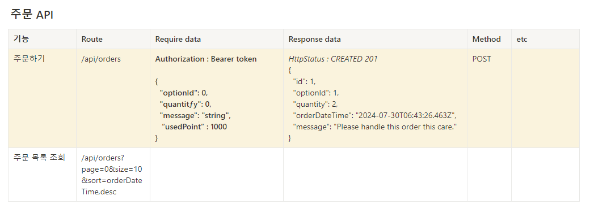
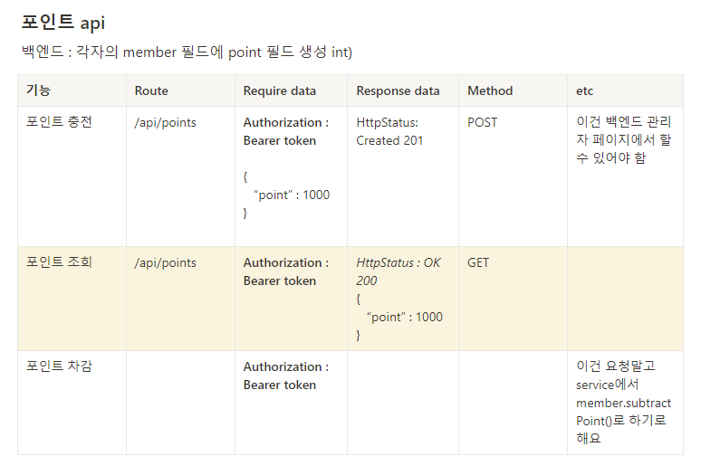

# spring-gift-point

https://www.notion.so/6-api-3d91cc23fb1e435eaf34ff1a8e51eaf1?pvs=4

**팀 API 명세서**

### 기능 요구사항 작성
- [X] 팀원과 의논한 팀 API 명세서를 바탕으로 코드 리팩토링 

# 🚀포인트 구현

### 기능 요구 사항

---

상품 구매에 사용할 수 있는 포인트 기능을 구현한다.

- [X]  포인트는 사용자별로 보유
    - [X]  Member : Point = 1 : 1
    - [X]  관리자 화면에서 포인트를 충전하여 사용하는 방식이다.
- [X]  포인트 차감
    - [X]  상품을 주문하면 포인트에서 차감된다.
- [X]  관리자 화면에서 포인트 충전 가능
